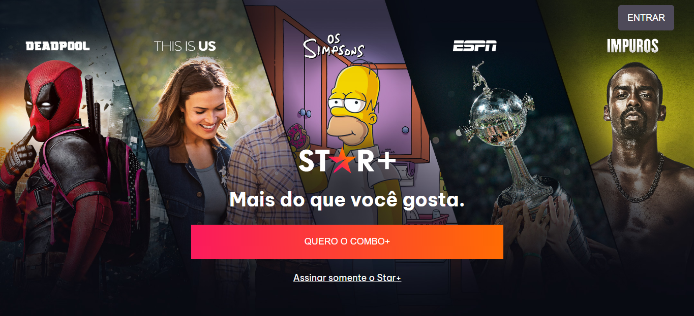

# **UI CLONE**

## A project to learn more about HTML and CSS

&logo=<LOGO>">
&logo=<LOGO>">
&logo=<LOGO>">

## **Star+ UI Clone**

<h2>The initial page</h2>

 

<h3>I started this project thinking about practice more using HTML and CSS.  Star+ UI Clone is my second project, and I want to update it in the future.</h3>
 
<h3>Technologies:</h3>

- 🔗HTML
- 🔗CSS
   

<h4 align="center"> 
	🚧  Project... 🚀 Loading...  🚧
</h4>
